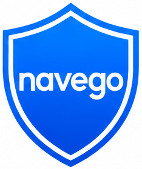

# navego



O Navego foi criado para quem quer navegar com mais calma, sem anúncios distrativos e com controles simples que funcionam bem desde a primeira vez que você usa.

Esta extensão oferece um design limpo, menus fáceis e símbolos claros para que qualquer pessoa — especialmente quem navega menos frequentemente — se sinta segura ao usar a web.

## Sobre o projeto

Este projeto foi pensado para deixar a experiência na web mais confortável para quem prefere uma extensão fácil de usar, sem muitas opções complicadas. O Navego oferece uma interface intuitiva com feedback visual em tempo real sobre quantos anúncios foram bloqueados.

O navego ajuda a:

- **bloquear anúncios e rastreadores comuns** com contadores em tempo real;
- **visualizar estatísticas de bloqueio** — mostra quantos anúncios foram bloqueados na página atual e no total desde a instalação;
- **impedir formulários de pagamento suspeitos** de forma silenciosa;
- **oferecer um modo rigoroso** para bloquear todos os formulários, se desejado;
- **manter o popup simples** com confirmação antes de desligar a proteção;
- **aplicar acessibilidade personalizada** com opções de tamanho de fonte, modo escuro e alto contraste.

## Quem pode usar

- pessoas mais idosas;
- usuários que acessam a internet com pouca frequência;
- quem quer uma extensão funcional, com interface intuitiva e sem complicações técnicas.

## Funcionalidades

- ✅ **bloqueio inteligente de anúncios e rastreadores** em tempo real;
- ✅ **contadores de bloqueio funcionais**:
  - Mostra quantos anúncios foram bloqueados nesta página
  - Mostra o total de anúncios bloqueados desde a instalação
- ✅ **bloqueio de formulários de pagamento suspeitos** com sobreposição visual;
- ✅ **modo rigoroso** para bloquear todos os formulários da página;
- ✅ **popup com botão principal de ligar/desligar** com confirmação;
- ✅ **tela de configurações com opções simples e acessíveis**:
  - Bloquear anúncios nativos
  - Bloquear rastreadores
  - Ativar listas de filtros online (EasyList e EasyPrivacy)
  - Bloquear formulários de pagamento
  - Modo rigoroso
  - Acessibilidade: tamanho de fonte, modo escuro e alto contraste
- ✅ **descrições de imagem acessíveis** para tecnologias assistivas.

### Algumas opções explicadas

- **Bloquear anúncios nativos**: remove banners e blocos de publicidade que aparecem diretamente na página, deixando o conteúdo principal mais limpo.
- **Bloquear rastreadores**: impede scripts que tentam seguir sua navegação em diferentes sites, preservando sua privacidade.
- **Ativar filtros online**: ao ligar EasyList e EasyPrivacy, o Navego usa regras extras atualizadas para bloquear mais anúncios e rastreadores conhecidos.
- **Bloquear formulários de pagamento**: identifica e bloqueia formulários suspeitos de pagar sem querer, protegendo usuários que não querem fornecer dados sensíveis.
- **Modo rigoroso**: quando ativado, o Navego age com mais firmeza e bloqueia todos os formulários, ideal para quem prefere uma navegação mais segura e sem preocupações.
- **Acessibilidade**: você pode ajustar o tamanho da fonte, alternar para modo escuro e alto contraste para facilitar a leitura e o uso em qualquer ambiente.

## Como instalar no Firefox

### Pré-requisitos
- Firefox versão 109 ou superior
- Git (para clonar o repositório) ou download do arquivo ZIP

### Passos de Instalação

#### 1️⃣ **Obter os arquivos do navego**

**Opção A: Via Git**
```bash
git clone <seu-repositorio-url>
cd Navego-main
```

**Opção B: Via ZIP**
- Faça o download do arquivo ZIP do repositório
- Extraia a pasta `Navego-main` em um local seguro no seu computador

#### 2️⃣ **Abrir o Firefox e acessar a página de extensões**

1. Abra o Firefox
2. Na barra de endereços, digite `about:debugging`
3. Pressione Enter

#### 3️⃣ **Ativar o modo de desenvolvimento (Manifest V2)**

1. Na página de debugging, clique em **"This Firefox"** no menu lateral esquerdo
2. Procure por **"Enable extension debugging"** e ative essa opção (se solicitado)

#### 4️⃣ **Carregar a extensão**

1. Clique no botão **"Load Temporary Add-on..."** (Carregar extensão temporária)
2. Navegue até a pasta `Navego-main` que você clonou ou extraiu
3. Selecione o arquivo `manifest.json`
4. Clique em **"Abrir"**

#### 5️⃣ **Confirmar a instalação**

- A extensão deve aparecer na lista de extensões na página `about:debugging`
- Um ícone do navego deve aparecer na barra de ferramentas do Firefox
- Clique no ícone para abrir o popup

### 📌 Notas Importantes

- **Instalação Temporária**: A extensão será removida quando você fechar o Firefox. Para instalar permanentemente, você precisa fazer upload para a loja oficial do Firefox (Firefox Add-ons).
- **Manifest V2**: O navego usa Manifest V2. Firefox ainda suporta Manifest V2 para teste em modo de desenvolvimento.
- **Modo de Desenvolvimento**: A extensão só carregará com `about:debugging`. Se fechar o Firefox, você precisará repeti os passos 2-4 na próxima vez.

## Como usar

1. Após instalar a extensão, o popup aparecerá quando você clicar no ícone do navego na barra de ferramentas.
2. **Botão Principal**: Clique no grande botão com a imagem para ligar/desligar a proteção.
3. **Contadores de Bloqueio**: Veja quantos anúncios foram bloqueados:
   - "Anúncios bloqueados" = anúncios bloqueados nesta página
   - "Total bloqueado" = anúncios bloqueados desde a instalação
4. **Configurações**: Clique no ícone de engrenagem (⚙) para personalizar as opções de bloqueio e acessibilidade.
5. **Desativar Proteção**: Se clicar no botão quando a proteção está **ligada**, será solicitada uma confirmação antes de desligar.

## Estrutura do projeto

```
Navego-main/
├── background.js          → Lógica em segundo plano da extensão
├── content.js             → Intercepta, bloqueia conteúdo nas páginas e rastreia anúncios
├── manifest.json          → Configuração da extensão (Manifest V2)
├── rules.json             → Regras de bloqueio
├── popup/
│   ├── popup.html         → Interface do popup com contadores
│   ├── popup.js           → Lógica dos contadores e controles
│   └── popup.css          → Estilos do popup
├── options/
│   ├── options.html       → Página de configurações
│   ├── options.js         → Lógica das configurações
│   └── options.css        → Estilos das configurações
├── Images/                → Ícones e recursos visuais
└── README.md              → Este arquivo
```

### Arquivos principais

- **background.js**: Gerencia eventos da extensão e atualiza rulesets de bloqueio quando a proteção é ligada/desligada
- **content.js**: Detecta e bloqueia anúncios, rastreadores e formulários suspeitos. Incrementa os contadores de anúncios bloqueados em tempo real
- **popup.html/js**: Interface visual com botão toggle, contadores funcionais ("Anúncios bloqueados" e "Total bloqueado") e acesso rápido às configurações
- **options.html/js**: Painel de configurações com opções de bloqueio e acessibilidade

## Observações

O foco do projeto é tornar a navegação mais segura e menos confusa, com uma experiência pensada para quem não usa a internet todos os dias e quer algo prático.

### Como os Contadores Funcionam

- **Anúncios bloqueados (nesta página)**: Reseta a zero quando você carrega uma nova página, mostrando quantos anúncios foram bloqueados na página atual
- **Total bloqueado (desde a instalação)**: Persiste até que você desinstale a extensão, acumulando o total de todos os anúncios bloqueados em todas as páginas

Ambos os contadores são atualizados em tempo real quando anúncios são detectados e bloqueados.

## Troubleshooting

### A extensão não carrega no Firefox
- Certifique-se de que o Firefox está atualizado (versão 109+)
- Verifique se você está usando `about:debugging` para carregar a extensão
- Tente remover e adicionar a extensão novamente

### Os contadores não aumentam
- Certifique-se de que a opção "Bloquear Anúncios Nativos" está ativada em Configurações
- Verifique se a proteção está ligada (ícone deve estar colorido)
- Tente recarregar a página (F5)

### A extensão desaparece após fechar o Firefox
- Isso é esperado em modo temporário. Para instalar permanentemente, faça upload para Firefox Add-ons
- Para cada sessão do Firefox, você precisará repetir os passos de instalação

## Licença

Este projeto está licenciado sob a [Licença](LICENSE) definida no repositório.

## Contribuições

Sugestões e feedback são bem-vindos! Abra uma issue ou entre em contato para melhorias futuras.
